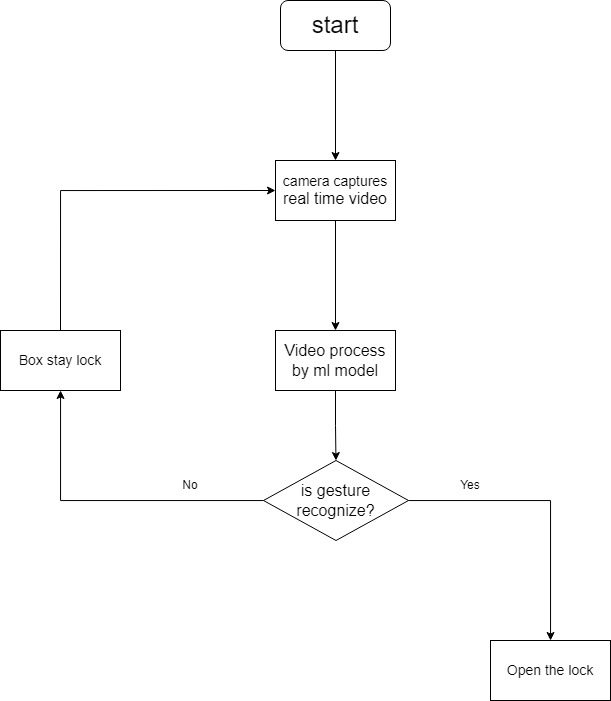

# IoT-project

## Smart box with laser ir sensor

## Overview
-**Project**: This IoT project integrates a IR sensor onto a box with a lock that detect a IR laser movement to unlock it.

-**Possible use case**: User can store their valuables or gold or idk what u would want to store in a private place u weirdo. By setting a passcode when the box initialize, and when someone without a ir laser wand, they will have no way to open the box except throw it on the ground and break it. However, if you, the owner, didn't bring the magic wand, you can also use your cellphone to connect to the box's ip and do a virtual unlock which require you to draw your password on your phone to unlock it.

-**Project objectives**: In this project, you should be able to create a special box which contains a front facing ir camera and some servo motor to unlock the box. Also the box has to be connected to the Internet in order to use it when you don't have the magic wand or you want to let others open the box via Internet.

## Features
- **Gesture Recognition**: Detects specific hand or body gestures using the camera.
- **Smart Lock System**: Unlocks the box when a valid gesture is recognized.
- **Real-Time Detection**: Provides quick gesture response for user convenience.
- **Security**: Supports only pre-configured gestures, providing an extra layer of security.

## Current survey
There's others that have done this before but none of them have implement using internet to interact with the box, which is why I want to implement this feature into the project itself. And while I'm doing the survey, I found out that I' not that great in design mechanical parts. I might need some help with the mechanic part and also Machine learning part. I also want to implement teaching it how to learn new password in real time instead of feeding it large amount of sample size beforehand. 

## Technology Stack
- **Hardware**: 
  - Raspberry Pi 4 or higher(for IoT functionality)
  - USB/PI Camera
  - Servo motor or solenoid lock for the box
- **Software**:
  - Python (OpenCV for gesture recognition)
  - Machine Learning model for gesture detection (TensorFlow/Keras)
  - MQTT (optional) for cloud communication
  - Flask/Node.js (optional) for web-based monitoring and control interface

## Components
1. **Camera**: Captures real-time video of the user.
2. **Processing Unit**: Raspberry Pi processes the video feed and runs the gesture recognition model.
3. **Locking Mechanism**: Servo motor or solenoid to physically unlock the box upon valid gesture detection.
4. **Power Supply**: Ensure reliable power for the system (e.g., a power bank or battery pack).

## Proposed methodologies
A simple flowchart show how the magic box will operate

In order to achieve this flowchart, you will need a custom 3D printed box, a lock and a camera. For it to work, put ir camera in the front of the box, then use a pre train alphabet model to 
do the gesture recognition, then connect the lock with camera, whenever camera detect a correct alphabet, the box will unlock itself, making this work.

## Reference
**https://maker.pro/raspberry-pi/projects/wand-controlled-horcrux-box**

## WIP